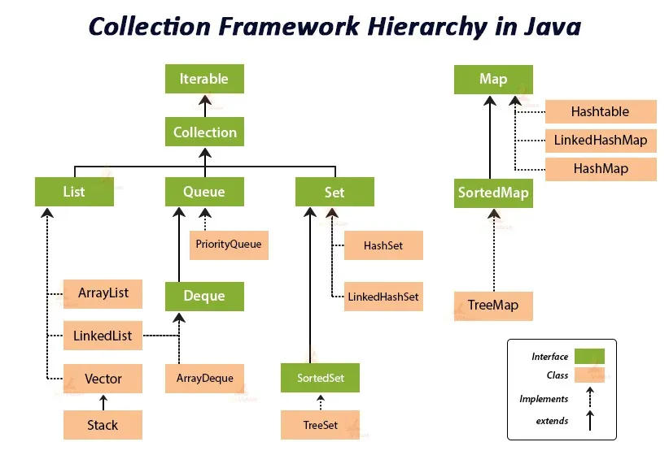

# 🎓 Java Collections Framework (JCF)

---

## 🧠 What is Java Collections Framework (JCF)?

### 📌 Definition:

> **Java Collections Framework** is a **set of classes and interfaces** in `java.util` package that provides **ready-made data structures** (like List, Set, Map, Queue) and **algorithms** (like sorting, searching) to store, access, and manipulate groups of objects efficiently.

---

## 🔍 Why Do We Need Collections?

| 🧱 Without Collections (Before Java 1.2) | ✅ With Collections                   |
| ---------------------------------------- | ------------------------------------ |
| Had to use arrays only (`Object[]`)      | Can use dynamic, powerful containers |
| Manual resizing, sorting, searching      | Built-in utilities and algorithms    |
| Difficult to manage large data           | Flexible and standardized            |

---


## 🧰 Core Components of JCF

### 1. **Interfaces (Blueprints)**

These define **types of collections**:

| Interface    | Description                              | Examples                      |
| ------------ | ---------------------------------------- | ----------------------------- |
| `Collection` | Root of the collection hierarchy         | `List`, `Set`, `Queue`        |
| `List`       | Ordered, allows duplicates               | `ArrayList`, `LinkedList`     |
| `Set`        | No duplicates                            | `HashSet`, `TreeSet`          |
| `Queue`      | FIFO order                               | `LinkedList`, `PriorityQueue` |
| `Deque`      | Double-ended queue                       | `ArrayDeque`                  |
| `Map`        | Key-value pairs (not part of Collection) | `HashMap`, `TreeMap`          |

---

### 2. **Implementations (Classes)**

These provide concrete behavior for interfaces:

| Interface | Implementation Classes                             |
| --------- | -------------------------------------------------- |
| `List`    | `ArrayList`, `LinkedList`, `Vector`, `Stack`       |
| `Set`     | `HashSet`, `LinkedHashSet`, `TreeSet`              |
| `Queue`   | `LinkedList`, `PriorityQueue`, `ArrayDeque`        |
| `Map`     | `HashMap`, `TreeMap`, `LinkedHashMap`, `Hashtable` |

---

### 3. **Algorithms (Collections class)**

Utility methods in `java.util.Collections` class:

```java
Collections.sort(list);
Collections.reverse(list);
Collections.shuffle(list);
Collections.max(list);
```

---

### 4. **Iterator Interface**

| Iterator Type  | Description                            |
| -------------- | -------------------------------------- |
| `Iterator`     | Forward-only traversal                 |
| `ListIterator` | Bidirectional for `List` types         |
| `Enumeration`  | Legacy (used in `Vector`, `Hashtable`) |

---

## 📦 Key Package:

```java
import java.util.*;
```

---

## 🔐 Benefits of JCF

| ✅ Feature                    | 💬 Description                                          |
| ---------------------------- | ------------------------------------------------------- |
| **Reusable Data Structures** | No need to build linked list, map, etc. from scratch    |
| **Type Safety** (Generics)   | Compile-time type checks → `List<String>`               |
| **Standardized API**         | Common methods like `add()`, `remove()`, `size()`       |
| **Interoperability**         | Easily convert between collections (`List ↔ Set`)       |
| **Thread-safe versions**     | `Collections.synchronizedList()` or `ConcurrentHashMap` |

---

## 🚦 Hierarchy Diagram

```plaintext
                Iterable
                   ↑
               Collection
         ↙        ↓        ↘
      List       Set      Queue
       ↑          ↑         ↑
ArrayList    HashSet   LinkedList
LinkedList   TreeSet   PriorityQueue

                Map (separate)
                   ↑
               HashMap
               TreeMap
             LinkedHashMap
```

---

## 🧪 Real-World Examples

| Use Case              | Collection Used                              |
| --------------------- | -------------------------------------------- |
| Shopping cart         | `List<Product>` (ordered, allows duplicates) |
| Unique user IDs       | `Set<String>`                                |
| Task processing queue | `Queue<Task>`                                |
| Phonebook             | `Map<String, PhoneNumber>`                   |

---

## 🧼 Best Practices

| ✅ Do’s                                                   | ❌ Don’ts                                        |
| -------------------------------------------------------- | ----------------------------------------------- |
| Prefer interfaces (`List`, `Set`) over classes           | Don’t expose implementation (`ArrayList`)       |
| Use generics for type safety                             | Avoid raw types (`List list = new ArrayList()`) |
| Use `Collections.unmodifiableList()` for read-only views | Don't allow external modification directly      |

---

## 🏁 Summary Table

| 🔍 Concept      | 📦 Java Collections Framework                         |
| --------------- | ----------------------------------------------------- |
| Introduced in   | Java 1.2                                              |
| Package         | `java.util`                                           |
| Core Interfaces | `Collection`, `List`, `Set`, `Queue`, `Map`           |
| Utilities       | `Collections`, `Arrays`, `Iterator`, `Comparator`     |
| Type Safe       | ✅ Yes (with Generics)                                 |
| Real-World Use  | Used **everywhere** in enterprise and Android apps 🚀 |

---

